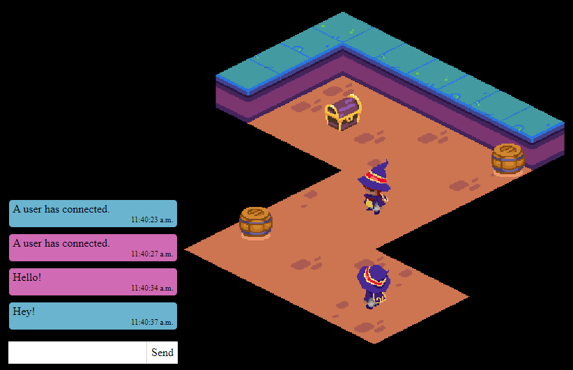

# Living Room Arcades

**Living Room Arcades** is a 2.5D multiplayer browser game. Players take the role of an arcade owner, embarking on quests to build their dream arcade. The mechanics are driven by rhythm based minigames.

I'm making a game in React without `<canvas>` as a constraint, to improve my knowledge of performance optimization in React.



## Roadmap

- [X] Use Next.js to persist game state between edits
- [X] 2.5D isometric map generated using Tiled
- [X] Pathfinding with obstacles
- [X] TypeScript
- [X] Remove Typescript
- [X] Chat using WebSockets
- [X] Multiplayer with real-time player positions
- [X] Dockerize app
- [ ] Deploy to Digital Ocean with CI/CD
- [ ] Monster with fighting minigame
- [ ] Harvestable node with harvesting minigame
- [ ] Fighting and harvesting XP
- [ ] Postgres
## Getting Started

```
# Copy environment variables
$ cp env/dev.env.sample env/dev.env

# Install dev dependencies for automatic code formatting
$ pnpm install

$ ./debug.sh
```

- Next app: **http://localhost:1337**